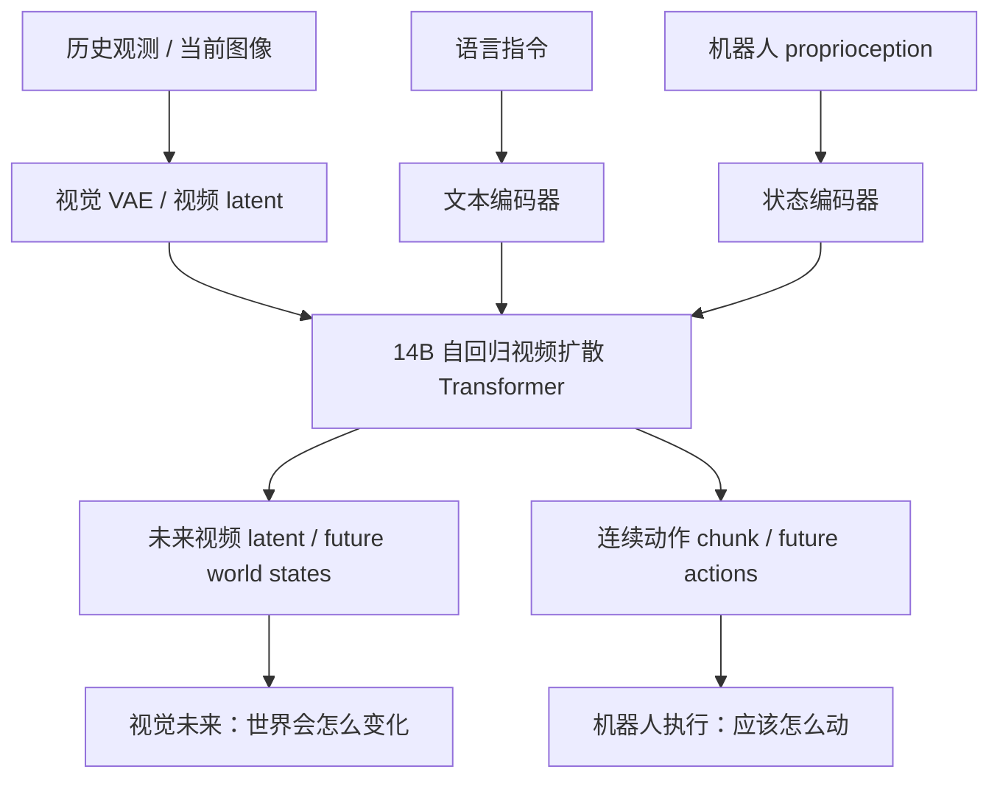
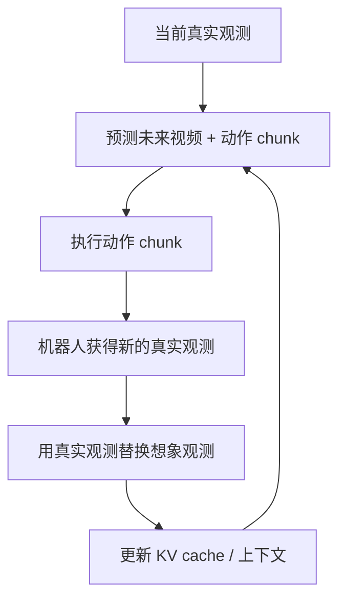
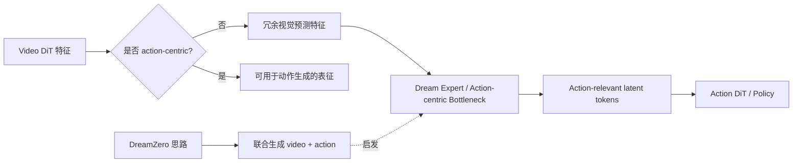

# DreamZero / World Action Models are Zero-shot Policies

tags: #WAM #WorldActionModel #VideoDiffusion #RobotManipulation #CrossEmbodiment #Generalization

## 1. 基本信息

- **论文**：World Action Models are Zero-shot Policies
- **系统 / 方法名**：DreamZero
- **年份**：2026
- **类别**：[[World Action Model]] / 基于视频生成模型的机器人策略
- **关键词**：World Action Model、WAM、视频扩散模型、动作生成、逆动力学、zero-shot policy、跨 embodiment 迁移、实时闭环控制
- **相关笔记**：[[Cosmos_Policy]]、[[pi0.7]]、[[LatBot]]

---

## 2. 一句话总结

**DreamZero 的核心观点是：机器人 foundation model 不应该只做“视觉语言输入 → 动作”的映射，而应该联合预测“未来世界状态 + 机器人动作”；通过把未来视频生成和连续动作生成绑定在一起，WAM 可以获得比传统 VLM-based VLA 更强的新任务、新动作、新环境和跨 embodiment 泛化能力。**

---

## 3. 核心动机

这篇论文从当前 VLA 的一个核心缺陷出发：

- VLM-based VLA 继承了图文预训练中的强语义能力；
- 但静态图文预训练很难学到物理运动、接触变化、时序因果和几何动态；
- 所以 VLA 往往可以识别新物体、理解新语言，但对**未见过的物理动作 / 新技能 / 新环境动态**泛化较弱。

DreamZero 认为，视频生成模型提供了另一类更适合机器人操作的先验：

```text
VLM 先验：
    物体是什么，语言是什么意思，场景语义是什么

Video Model 先验：
    世界如何变化，物体如何运动，接触如何影响状态，动作如何驱动视觉变化
```

因此，它不是继续把 VLM 当成 robot policy backbone，而是提出 **World Action Model (WAM)**：

```text
p(未来视频, 未来动作 | 历史观测, 语言指令, 本体状态)
```

也就是说，模型同时想象未来世界，并生成能导致这个未来的动作。

---

## 4. 在阅读路线中的位置

DreamZero 和 [[Cosmos_Policy]] 同属于 video-model-based robot policy，但重点不同。

| 维度 | Cosmos Policy | DreamZero |
|---|---|---|
| 基础模型 | Cosmos-Predict2-2B 视频扩散模型 | 14B 自回归视频扩散 Transformer |
| 主要输出 | action + future state + value | future video + continuous action |
| 核心 claim | 视频模型可以统一作为 policy / world model / value model | WAM 可以作为 zero-shot robot policy |
| 规划方式 | best-of-N + predicted value | 自回归闭环控制 |
| 泛化重点 | 强策略与测试时规划 | 新动作、新任务、新环境、跨 embodiment |
| 系统重点 | 单阶段 fine-tuning | 大模型规模化、实时闭环、跨 embodiment |

可以粗略理解成：

```text
Cosmos Policy：
    video model as policy + world model + value model

DreamZero：
    video-action joint generation as generalist robot foundation model
```

---

## 5. 方法总览

### 5.1 WAM 公式

DreamZero 把 WAM 定义为：给定当前 / 历史观测、语言指令和机器人本体状态，同时预测未来视觉状态和动作。

```text
输入：
    历史图像 / 当前图像
    语言指令
    机器人 proprioception

输出：
    未来视频
    未来连续动作 chunk
```

更重要的是，它不是把视频预测当作普通辅助 loss，而是希望 **视频和动作被联合生成**，从而让动作和想象出来的世界演化对齐。

---

## 6. 图解：DreamZero 的核心数据流



这个图的关键是：**future video 和 action 不是两个互不相关的分支，而是共享一个自回归扩散 backbone。**

---

## 7. Future Video + Inverse Dynamics 的理解方式

一个很有用的理解是：

```text
DreamZero = 未来视频预测 + 逆动力学动作预测
```

但它不是简单训练两个独立模块，而是用共享生成式 backbone 让二者对齐。

直觉如下：

```text
如果模型想象出了一个合理的未来视觉状态，
那么它也应该知道：
从当前状态到这个未来状态，机器人需要执行什么动作。
```

因此，DreamZero 希望模型学到的不只是“下一步动作是什么”，而是：

```text
动作如何改变世界；
世界变化如何反过来约束动作。
```

---

## 8. 图解：为什么叫 World Action Model

```mermaid
flowchart LR
    O[当前世界状态 o_t] --> W[World Action Model]
    L[语言任务 l] --> W
    P[proprio q_t] --> W

    W --> V[未来世界状态 o_{t:t+H}]
    W --> A[未来动作 a_{t:t+H}]

    V -.对齐.-> A
    A -.导致.-> V
```

普通 VLA 学的是：

```text
π(a | o, language)
```

DreamZero 学的是：

```text
p(o_{t:t+H}, a_{t:t+H} | o_{≤t}, language, proprio)
```

这就是 WAM 与传统 VLA 的核心区别。

---

## 9. 为什么使用自回归结构？

DreamZero 强调 autoregressive video diffusion，是因为机器人控制天然是闭环过程。

推理循环可以理解成：



这样做有三个好处：

1. **闭环纠错**：模型不用一直沿着自己想象的视频 rollout 下去，因为真实观测会不断写回上下文；
2. **更高效**：自回归结构可以复用历史 KV cache；
3. **时间对齐更自然**：未来视频和动作按时间因果顺序共同展开。

这也是 DreamZero 和普通离线视频生成模型的区别：它不是只生成视频，而是服务于机器人闭环控制。

---

## 10. 训练数据视角

DreamZero 反复强调：**多样化、非重复的机器人数据，可能比每个任务大量重复 demonstration 更有利于泛化。**

传统 imitation learning 更偏好：

```text
每个任务很多条干净、高质量、重复 demonstration
```

DreamZero 更偏好的数据形态是：

```text
多样化机器人轨迹
异质交互数据
非重复行为
人类或其他机器人的 video-only demonstration
新 embodiment 上少量 play data
```

原因是，WAM 从视频预测中可以利用每一段状态转移学习“世界如何变化”，而不仅仅是从 episode-level task label 中学模仿。

---

## 11. 主要实验 claim

论文主要想证明五件事：

1. DreamZero 相比强 VLA baseline，在未见任务和未见环境中有更强泛化；
2. joint video-action modeling 比静态 VLM-based policy 更适合新动作 / 新技能泛化；
3. 来自人类或其他机器人的 video-only 数据可以提升目标机器人表现；
4. 新 embodiment 可以用极少 play data 适配；
5. 通过算法、系统和底层 kernel 优化，14B 视频扩散模型可以实现约 7Hz 实时闭环控制。

需要注意：

```text
这里的 “zero-shot” 不是指完全不使用机器人数据。
它指的是：经过 WAM 训练后，对未见任务 / 未见动作 / 未见环境进行 zero-shot 泛化。
```

---

## 12. 核心优势

### 12.1 比 VLM-based VLA 更强的物理动态先验

DreamZero 最核心的优势是直接攻击了 VLM-based VLA 的弱点：缺乏动态物理先验。

对于机器人操作，知道物体语义是不够的，还要理解：

- 物体怎么运动；
- 接触如何改变状态；
- 机器人动作如何影响场景；
- 什么样的视觉未来对应任务进展。

WAM 的 joint video-action modeling 正是针对这些问题。

### 12.2 不是单纯视频预测，而是世界-动作对齐

DreamZero 不是把视频预测作为旁支任务。它想让动作和未来视觉状态在同一个生成过程中对齐。

这点很重要，因为：

```text
只预测视频：
    未来看起来合理，但不一定对应可执行动作。

只预测动作：
    可以模仿数据，但不一定理解动作如何改变世界。

联合预测 video + action：
    试图把“看起来会发生什么”和“机器人应该怎么做”绑定起来。
```

### 12.3 跨 embodiment 和 video-only 数据潜力

如果模型能从人类视频或其他机器人视频中获益，而不需要目标机器人 action label，那么机器人数据扩展的成本会显著下降。

这是 WAM 相比传统 VLA 的重要潜力：

```text
传统 VLA：
    更依赖目标 embodiment 的 action 数据。

WAM：
    video-only 数据也可以提供世界动态知识。
```

### 12.4 实时系统工程

14B 视频扩散模型天然非常慢。DreamZero 的系统贡献在于通过：

- decoupled video/action denoising schedules；
- KV cache / 并行策略；
- quantization；
- CUDA kernel 优化；

把大视频扩散模型推到可用于真实机器人闭环控制的速度。

---

## 13. 局限与需要谨慎的地方

### 13.1 “Zero-shot” 需要谨慎理解

DreamZero 不是从纯互联网视频直接 zero-shot 控制机器人。它仍然经过了机器人数据训练。它的 zero-shot 主要指对未见任务、未见环境、未见动作的泛化。

### 13.2 系统成本极高

这个方法很难被普通实验室完整复现，因为它依赖：

- 14B 视频扩散模型；
- 大规模真实机器人数据；
- 跨 embodiment 数据；
- 系统级并行与缓存；
- quantization；
- CUDA kernel 优化；
- 真实机器人部署基础设施。

### 13.3 视频合理不等于动作成功

即使预测的视频看起来合理，对应动作也可能：

- 物理上不可执行；
- 对当前 embodiment 不稳定；
- 精细操作误差过大；
- 视觉上变化很小但动作要求很精确。

DreamZero 通过 joint action decoder 缓解这个问题，但这仍然是所有 WAM 都要面对的核心风险。

### 13.4 不是显式长程任务规划器

DreamZero 更强在 skill / motion / environment generalization，而不是显式子任务分解。对于需要长程记忆、任务进度跟踪和高层规划的任务，可能仍需要 Hi-VLA、memory 或 streaming planner。

---

## 14. 和相关方法对比

### 14.1 对比 [[Cosmos_Policy]]

Cosmos Policy：

```text
current state + language
    → action + future state + value
    → direct execution 或 best-of-N planning
```

DreamZero：

```text
history observation + language + proprio
    → autoregressive future video + action
    → closed-loop robot execution
```

Cosmos Policy 更强调统一 policy / world model / value model，并通过 value 支持 best-of-N planning。DreamZero 更强调 WAM 作为 generalist robot foundation model，突出 zero-shot 和 cross-embodiment 泛化。

### 14.2 对比 [[pi0.7]]

π0.7 是 rich-context VLA：

```text
observation + language + subtask + subgoal image + metadata → action
```

DreamZero 是 world-action generative policy：

```text
observation history + language + proprio → future video + action
```

π0.7 中 world model 主要用来生成 subgoal image 作为 prompt；DreamZero 则让 world model 本身成为 policy backbone。

### 14.3 对比 latent action 方法

Latent action 方法，比如 [[LatBot]]，通常是：

```text
从视频中学习紧凑动作表示
再蒸馏 / 迁移给 VLA policy
```

DreamZero 则是：

```text
直接训练大模型联合生成未来世界和动作
```

粗略区别：

```text
Latent Action：
    学一个 compact action representation，服务于 policy。

DreamZero：
    直接把 world prediction 和 action generation 统一成一个 WAM。
```

---

## 15. 和我研究方向的关系

DreamZero 和我的 WAM / action-centric representation 方向高度相关。

### 15.1 支持 ACR-WAM 的动机

我的动机是：视频预测特征往往冗余，并不一定 action-centric。DreamZero 支持“视频和动作必须对齐”这个判断，只不过它是用非常大的模型和联合生成来实现。

可以这样对应：

```text
DreamZero：
    超大规模 shared video-action generative model

ACR-WAM / Dream Expert：
    轻量模块，把 video features 压缩成 action-relevant latent tokens
```

### 15.2 Video feature 必须 action-bound

这篇论文给我的关键启发是：未来视觉预测不能只是孤立的 auxiliary task。它应该通过某种机制和动作预测绑定，例如：

- shared backbone；
- joint denoising；
- action-conditioned future prediction；
- future-conditioned inverse dynamics；
- value / success prediction。

### 15.3 数据多样性很重要

在我的实验中，可以区分：

```text
重复专家 demonstration
vs.
多样 rollout / failure / play data
```

WAM-style 模型可能比普通 BC 更能从多样 transition 中获益。

### 15.4 长程记忆仍然是开放问题

DreamZero 强在 motion 和 environment generalization，但没有完全解决 memory / task-progress tracking。这里仍然给 memory-based VLA、streaming planner 和 transition-aware Hi-VLA 留出了空间。

---

## 16. 对 ACR-WAM / Dream Expert 的启发图



这说明 DreamZero 对我的启发不是“直接复现 14B WAM”，而是：

```text
如何低成本地把视频特征变成动作相关表征？
```

---

## 17. 需要记住的结论

- WAM 不能被理解成“给 VLA 加一个视频预测辅助 loss”；
- 真正重要的是 **world-action alignment**；
- 未来视频预测只有在能改善动作选择或动作表示时才有意义；
- 跨 embodiment 扩展可能依赖 video-only 数据；
- 实用 WAM 既需要算法设计，也需要系统级加速；
- 对我的方向来说，DreamZero 最重要的启发是：**video features 必须被压缩 / 转换成 action-relevant representations。**

---

## 18. 后续需要回头细看的问题

1. DreamZero 具体如何对齐 video denoising 和 action denoising？
2. action latent 是通过独立 decoder 生成，还是类似 Cosmos Policy 一样注入到 video latent sequence？
3. robot data、human video、cross-embodiment data 的训练混合比例是多少？
4. 性能提升到底来自 video pretraining、数据多样性、模型规模，还是系统优化？
5. 小模型能不能通过 action-centric latent compression 复现一部分收益？

---

## 19. 简短结论

**DreamZero 的主要贡献是把 WAM 从一个概念扩展成大规模机器人 foundation model：通过联合预测未来视频和连续动作，它利用视频动态先验获得比传统 VLM-based VLA 更强的物理技能泛化。对我的研究来说，它最重要的启发是：视频特征必须被转换成动作相关表征，而不是停留在通用视觉预测特征。**
