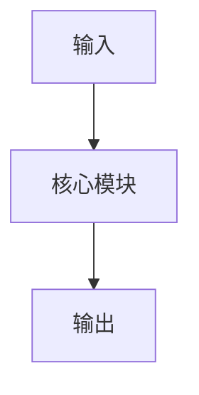

# {{title}}

tags: #paper

## 1. 基本信息

- 年份：
- 会议 / arXiv：
- 类别：
- 关键词：
- 和我研究的关系：
- 阅读状态：

## 2. 一句话总结

## 3. 核心动机

## 4. 方法

### 4.1 整体结构

### 4.2 关键模块

### 4.3 训练目标

### 4.4 推理流程

## 5. 图解

## 6. 实验

- Benchmark：
- Baseline：
- 主要结果：
- 消融实验：

## 7. 优点

## 8. 局限 / 问题

## 9. 和我研究的关系

## 10. 可借鉴的表达 / 观点

## 11. 相关笔记

- 
